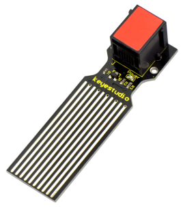
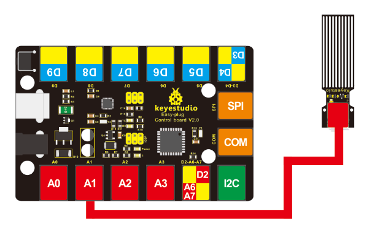
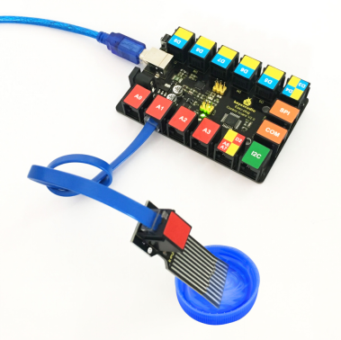
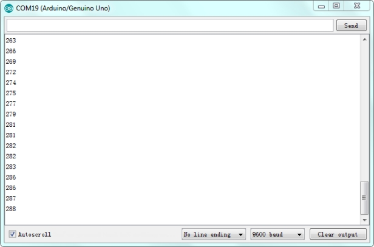

# KS0107 keyestudio EASY plug Water Sensor



## 1. Introduction

This sensor is easy-to-use, portable and particularly designed to identify and detect water level and water drop. 

It can measure the volume of water drop and water quantity through an array of traces of exposed parallel line. 

This sensor is small and equipped with the following features:

- smooth conversion between water quantity and analog quantity;
- strong flexibility, outputting analog value;
- low power consumption and high sensitivity;
- directly connected to microprocessor or other logic circuits, suitable for a variety of development boards and controllers such as Arduino controller, STC single-chip microcomputer, AVR single-chip microcomputer, etc.

**Special Note:**

The sensor/module is equipped with the RJ11 6P6C interface, compatible with our keyestudio EASY plug Control Board with RJ11 6P6C interface.

If you have the control board of other brands, it is also equipped with the RJ11 6P6C interface but has different internal line sequence, can’t be used compatibly with our sensor/module.

## 2. Features

- Connector: Easy plug
- Operating voltage: DC5V
- Operating current: <20mA
- Sensor type: Analog
- Detection area: 40mm x16mm
- Production process: FR4 double-side tinned
- Operating temperature: 10%~90% without condensation
- Production process: FR4 double-side tinned

## 3. Technical Details

- Dimensions: 68mm * 20mm * 18mm
- Weight: 5.7g

## 4. Connect It Up

Connect the EASY Plug water level sensor to control board using an RJ11 cable. Then connect the control board to your PC with a USB cable.



## 5. Upload the Code

Download code:  [Code](./Code.7z)

```c
int analogPin = 1; //connect water sensor to analog interface 1
int led = 13; //LED to digital interface 13
int val = 0; //define the initial value of variable ‘val’ as 0
int data = 0; //define the initial value of variable ‘data’ as 0

void setup()
{
    pinMode(led, OUTPUT); //define led as output pin
    Serial.begin(9600); //set baud rate at 9600
}

void loop()
{
    val = analogRead(analogPin); //read and assign analog value to variable ’val’
    if(val>700)//decide whether variable ‘val’ is over 700 
    { 
    	digitalWrite(led,HIGH); //turn on LED when variable ‘val’ is over 700
	}
    else
    {
        digitalWrite(led,LOW); //turn off LED when variable ‘val’ is under 700
    }
    data = val; //variable ’val’ assigns value to variable ‘data’
    Serial.println(data); //print variable ‘data’ by Serial.print
    delay(100);
}
```

## 6. Result

Hook it up and upload well the code, you will see the led light on the water sensor light up, then open the serial monitor, you will see the analog value.

When place the sensing area of sensor into the water, you can see the data change. The deeper the sensor’s sensing area into water, the greater the value. 



